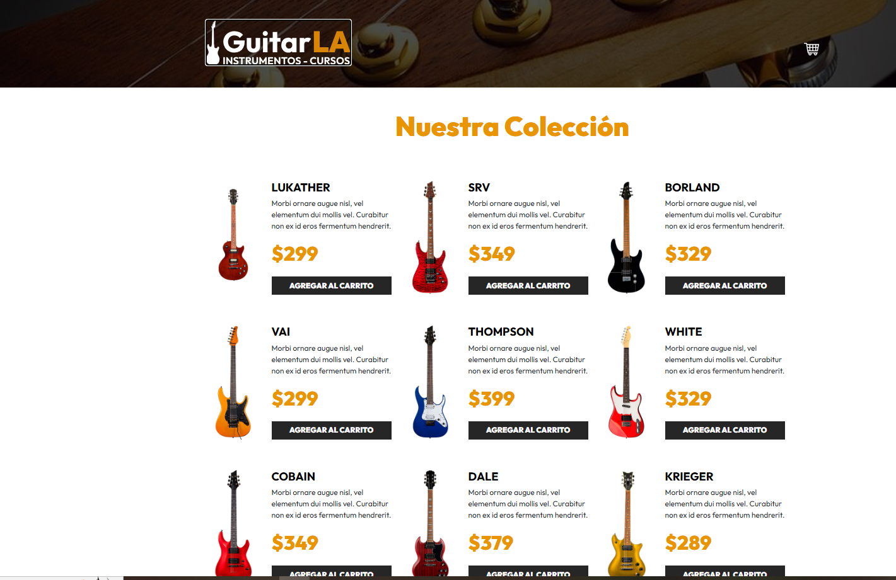

# 🎸 GuitarLA - Tienda de Guitarras con React

Este proyecto es una aplicación web desarrollada con **React** que simula una tienda de guitarras. El usuario puede navegar por una colección de guitarras, agregarlas a un carrito de compras, modificar cantidades, eliminar productos y vaciar el carrito. Todo el estado se maneja con `useState` y se comparte entre componentes de forma dinámica.

---

## 📸 Captura



---

## 🚀 Funcionalidades

- Visualización de guitarras disponibles
- Agregar productos al carrito
- Evita duplicados: incrementa cantidad si ya existe
- Incrementar y decrementar cantidad por producto
- Eliminar un producto del carrito
- Vaciar el carrito por completo
- Cálculo automático del total a pagar

---

## 🧑‍💻 Tecnologías Usadas

- ⚛️ React
- 💅 Bootstrap 5
- 🗃️ useState (manejo de estado)
- 📦 Vite (para empaquetar)
- 🖼️ Imágenes locales simuladas

---

## 📂 Estructura del Proyecto
guitarla-react/
│
├── public/
│ └── img/ (imágenes de guitarras y logo)
│
├── src/
│ ├── components/
│ │ ├── Guitar.jsx
│ │ └── Header.jsx
│ ├── data/
│ │ └── db.js
│ ├── App.jsx
│ └── main.jsx
│
├── index.html
└── package.json

⚙️ Cómo usar este proyecto

1. Clonar el repositorio:

```bash
git clone https://github.com/5Cristian/GuitarLA.git
cd GuitarLA

2. Instalar dependencias:

npm install


3. Ejecutar servidor de desarrollo:

npm run dev

4. Abrir en el navegador de tu preferencia:

http://localhost:5173

👨‍🏫 Créditos
Proyecto desarrollado por la clase de Desarrollo Web - UMG 2025.

🪄 Licencia
MIT - Puedes modificar y usar libremente con fines educativos.
